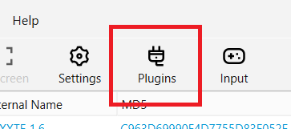
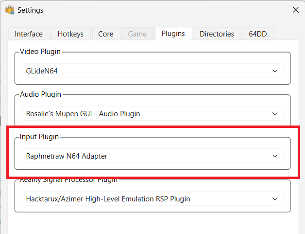
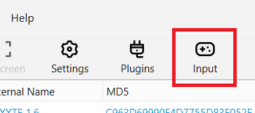

# Smash 64 Netplay Guide

To play Smash 64 online, follow the steps below. To use an N64 controller, you'll need a [Raphnet V3 USB adapter](https://www.raphnet-tech.com/products/n64_usb_adapter_gen3/index.php); you can also use any USB controller or a keyboard.

## 1. Download the RMG-K Emulator

[Download](https://github.com/Jay-Day/RMG-K/releases/latest){ .md-button .md-button--primary data-md-color-primary="green" data-md-color-accent="green" }
[GitHub](https://github.com/Jay-Day/RMG-K){ .md-button data-md-color-primary="green" data-md-color-accent="green" }

## 2. Obtain the Smash Bros. ROM

The Smash Bros game file, or ROM, is required to play online. You must **legally** obtain your own ROM. This site does not endorse or condone piracy. **Do not** ask how to obtain a ROM in Discord.

!!! Note "ROM Patching"
    Many online players play on modded versions of the game, such as Smash Remix or 19XX. Use our online [Remix](remix.md) or [19XX](19XX.md) patchers to modify your ROM.

## 3. Select your ROM Directory { #3-set-rom-directory data-toc-label='3. Configure ROM Directory' }

Open `RMG-K.exe` and click Select ROM Directory, then pick the folder where you saved the ROM.

## 4. Configure your Controller

Press the Plugins menu, and select your input plugin.

{ width=50% }
{ width=50% }

Select your plugin depending on your controller:

| Controller      | Plugin |
| ----------- | ----------- |
| N64 with Raphnet Adapter  | `Raphnetraw N64 Adapter`       |
| Gamecube with Native Adapter   | `Gamecube Adapter`        |
| Any other Controller or keyboard   | `Generic USB Input` |

If using the Gamecube or Generic USB plugins, then click the **Input** button and set your controls.

{ width=50% }

!!! Note "Gamecube Controllers"
    To use the Gamecube plugin, you must have a native-compatible adapter. Examples include Lossless, Nintendo, and Mayflash. If your adapter has multiple modes, **make sure it's set to Switch/Wii U/Native mode**, otherwise the input plugin won't detect it.

    If your adapter isn't supported, use the `Generic USB Input` plugin.

## 5. Start Netplay

!!! danger "Ethernet Highly Recommended"
    Use a wired Ethernet connection when playing netplay. WiFi connections are inherently unreliable and will frustrate you and your opponents.

Launch online play with the `Netplay` button. Use the `Change Mode` selector to choose between `Server` or `P2P` (Peer to Peer). Peer to peer connections are more stable, but only support up to two players. 

The regional Discords linked in the sidebar are a great way to find opponents for P2P matches.

=== "Connecting via Server"

    1. Start Netplay. Server mode is the default.
    2. Select the server to join. A full list of servers can be found by clicking `Master Servers List`.
    3. Host or join lobbies to play
    4. Host starts game

    Up to 4 players can play in server matches.

=== "Connecting via P2P"

    1. Start Netplay. Click the `Change Mode` dropdown and select `1. P2P`.
    2. Host must have ports forwarded and provide external IP to other player
    3. Host selects the game and clicks `Host`.
    4. Client chooses the Connect tab, enters the Host's IP in the `Peer IP` box, and connects.
    5. Both players tick `Ready` to start the game

    Only 2 players can play P2P.
---

The higher your ping to the server or your opponent, the more frames of delay you'll have. Most players play on 3 frames or less. After playing online, you **must** restart the emulator before playing a different player or if a new player joins the lobby. Servers may sometimes go down and active servers may be found on the master server list.

If you're having problems setting up netplay, ask in `#help` in the [Smash 64 Discord](https://discord.gg/ssb64).

### Legacy Emulators & Guides

- [Project64 KSE (Emulator)](https://github.com/smash64-dev/project64k-legacy/releases/latest/download/project64k-legacy.zip)
- [Project64k-legacy (GitHub)](https://github.com/smash64-dev/project64k-legacy)
- [Radiant Netplay Guide](https://docs.google.com/document/d/1jUqmsLqonkoCR_z7VBxyj6uCtpTnU6bL6oVfGEpKyZ8/view)
- [Pizza Netplay Guide (Outdated)](https://docs.google.com/document/d/1asbuKPAhHUGWgbJtLg7RJI5Hl_yDTJBlrpEQkgkgvkg/view)
